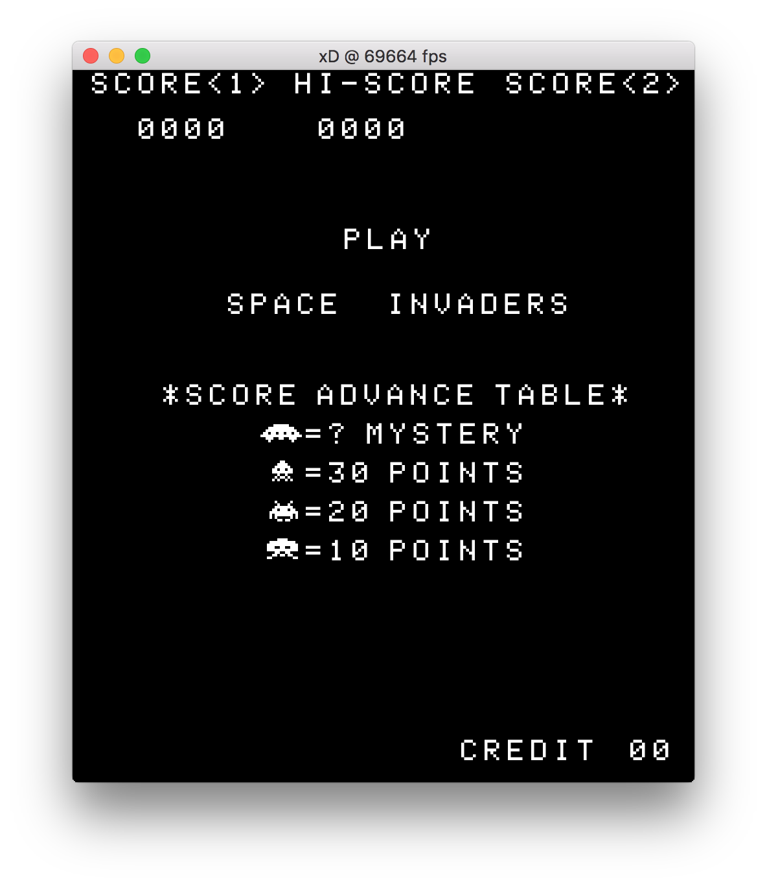
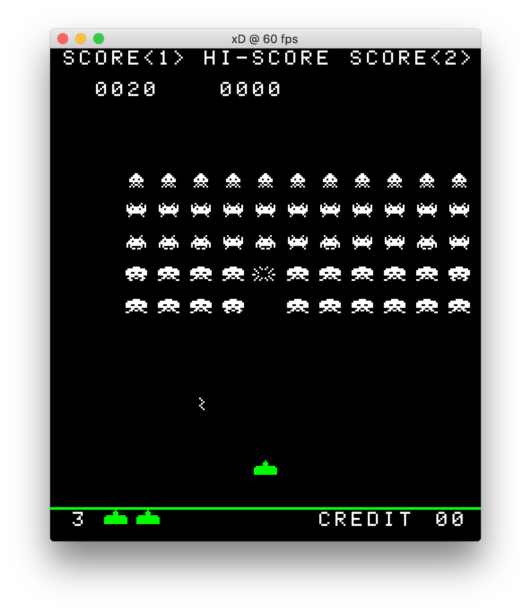

# Space Invaders remake

This is a remake of the old classic arcade game "Space Invaders" using a C++ graphics library called [libxd](https://bernhardfritz.github.io/libxd).

```bash
git clone https://github.com/bernhardfritz/spaceinvaders.git
cd spaceinvaders
```

To compile this on your machine, download [libxd 0.1.0](https://github.com/bernhardfritz/libxd/releases/tag/0.1.0) for your operating system and extract it's content into the `spaceinvaders` root directory.

```bash
make
./bin/sketch
```

>Hint: Instead of `make` and `./bin/sketch`, use `mingw32-make` and `.\bin\sketch.exe` respectively for Windows.




